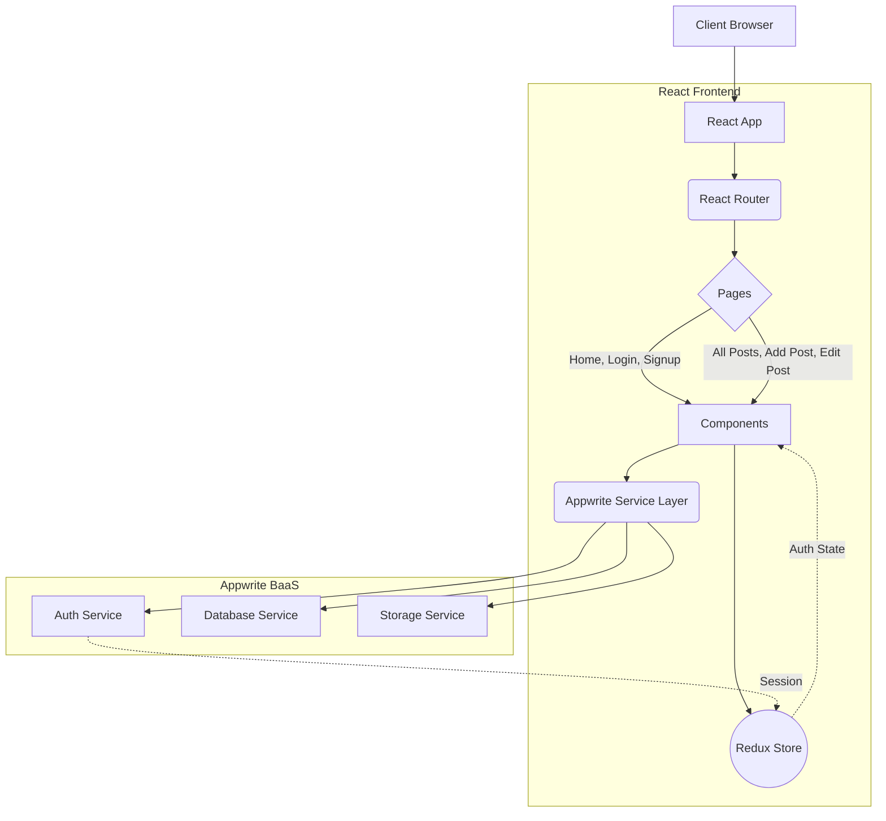

# React + Appwrite Blog Mega Project

A full-fledged modern blog application built with React, Redux Toolkit, React Router, Tailwind CSS, and Appwrite backend.

## 🚀 Features

- **User Authentication**: Secure Login and Signup functionalities.
- **Post Management**: Create, Read, Update, and Delete (CRUD) posts.
- **Rich Text Editor**: Integrated TinyMCE for a rich writing experience.
- **State Management**: Centralized application state using Redux Toolkit.
- **Routing**: Seamless navigation with React Router DOM.
- **Responsive Design**: Mobile-first design using Tailwind CSS.
- **Backend as a Service**: Powered by Appwrite for Auth, Databases, and Storage.

## 📸 Screenshots

> **Note:** Please add actual screenshots to a `docs/` folder or update these image paths.
> 
> 
> 
> 


## 🏗️ Architecture

The application follows a modular React frontend architecture communicating with the Appwrite cloud services.



### System Flow

1. **Pages**: Route-level components mapping URLs to Views (`Home`, `Login`, `Post`, `AddPost`).
2. **Components**: Reusable UI blocks (`Button`, `Input`, `PostCard`, `Header`, `Footer`, `AuthLayout`).
3. **State Management (Redux)**: Manages global states like Authentication status via `authSlice`.
4. **Appwrite Services (`src/appwrite`)**: Class-based services that abstract the Appwrite SDK interactions (`auth.js` for Authentication, `config.js` for Databases/Storage).

## 🛠️ Tech Stack

- **Frontend**: React 19, Vite, Tailwind CSS 4
- **State Management**: Redux Toolkit
- **Routing**: React Router DOM v7
- **Forms**: React Hook Form
- **Editor**: TinyMCE React
- **Backend/BaaS**: Appwrite (Authentication, Database, Storage)
- **Linting**: Oxlint

## ⚙️ Local Development

### Prerequisites

- Node.js (v18+)
- An active [Appwrite](https://appwrite.io/) project with Databases and Storage buckets configured.

### Setup

1. **Clone the repository**
   ```bash
   git clone https://github.com/daffodilnehasingh-hub/appwriteBlog.git
   cd appwriteBlog
   ```

2. **Install dependencies**
   ```bash
   npm install
   ```

3. **Configure Environment Variables**
   Create a `.env` file in the root directory based on the `.env.sample`.
   ```env
   VITE_APPWRITE_URL="https://cloud.appwrite.io/v1"
   VITE_APPWRITE_PROJECT_ID="your_project_id"
   VITE_APPWRITE_DATABASE_ID="your_database_id"
   VITE_APPWRITE_COLLECTION_ID="your_collection_id"
   VITE_APPWRITE_BUCKET_ID="your_bucket_id"
   ```

4. **Start the development server**
   ```bash
   npm run dev
   ```

## 📝 License

This project is licensed under the MIT License.
